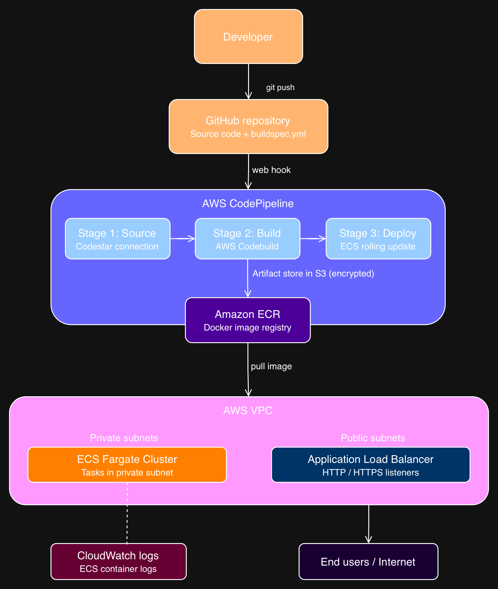

# Terraform AWS DevSecOps Infrastructure

This repository contains Terraform modules for provisioning a complete AWS DevSecOps infrastructure including ECS container orchestration, CI/CD pipeline with CodeBuild and CodePipeline, and Application Load Balancer.

## Architecture



## Infrastructure Overview

```
GitHub/GitLab Repository
        ↓ (webhook trigger)
AWS CodePipeline
        ↓
Stage 1: Source    → pulls code via CodeStar Connection
Stage 2: Build     → CodeBuild builds & pushes Docker image to ECR
Stage 3: Deploy    → deploys new image to ECS Fargate
        ↓
ECS Fargate Cluster
        ↓
Application Load Balancer
        ↓
End Users
```

## Modules

| Module | Description |
|--------|-------------|
| [alb](./modules/alb) | Application Load Balancer with target groups and listeners |
| [ecs](./modules/ecs) | ECS Fargate cluster, task definition, and service |
| [codebuild](./modules/codebuild) | CodeBuild project for building Docker images |
| [codepipeline](./modules/codepipeline) | Multi-stage CI/CD pipeline |

## Prerequisites

- [Terraform](https://developer.hashicorp.com/terraform/downloads) >= 1.5.0
- [AWS CLI](https://aws.amazon.com/cli/) configured with appropriate credentials
- AWS Account with permissions to create the required resources
- Existing VPC with public and private subnets
- CodeStar Connection to GitHub/GitLab (created manually in AWS Console)

## Quick Start

**1. Clone the repository**
```bash
git clone https://github.com/mujaddidsi/terraform-aws-devsecops.git
cd terraform-aws-devsecops
```

**2. Copy and configure variables**
```bash
cp terraform.tfvars.example terraform.tfvars
```

Edit `terraform.tfvars` with your actual values:
```hcl
vpc_id                  = "vpc-xxxxxxxxxxxxxxxx"
public_subnet_ids       = ["subnet-xxx", "subnet-yyy"]
private_subnet_ids      = ["subnet-aaa", "subnet-bbb"]
codestar_connection_arn = "arn:aws:codestar-connections:..."
repository_name         = "your-org/your-repo"
```

**3. Initialize Terraform**
```bash
terraform init
```

**4. Review the plan**
```bash
terraform plan
```

**5. Apply the infrastructure**
```bash
terraform apply
```

**6. Access your application**

After apply completes, get your application endpoint:
```bash
terraform output alb_dns_name
```

## Inputs

| Name | Description | Type | Default | Required |
|------|-------------|------|---------|----------|
| `aws_region` | AWS region to deploy resources | `string` | `ap-southeast-1` | ❌ |
| `name` | Name prefix for all resources | `string` | `indico` | ❌ |
| `environment` | Environment name | `string` | `production` | ❌ |
| `vpc_id` | VPC ID for all resources | `string` | - | ✅ |
| `public_subnet_ids` | Public subnet IDs for ALB | `list(string)` | - | ✅ |
| `private_subnet_ids` | Private subnet IDs for ECS | `list(string)` | - | ✅ |
| `container_image` | Docker image for ECS task | `string` | `nginx:latest` | ❌ |
| `container_port` | Port exposed by container | `number` | `80` | ❌ |
| `cpu` | CPU units for ECS task | `number` | `256` | ❌ |
| `memory` | Memory (MB) for ECS task | `number` | `512` | ❌ |
| `desired_count` | Desired ECS task count | `number` | `2` | ❌ |
| `source_type` | Source provider for CodeBuild | `string` | `GITHUB` | ❌ |
| `source_location` | Source repository URL | `string` | - | ✅ |
| `repository_name` | Repository name for CodePipeline | `string` | - | ✅ |
| `branch_name` | Branch to trigger pipeline | `string` | `main` | ❌ |
| `codestar_connection_arn` | ARN of CodeStar connection | `string` | - | ✅ |
| `certificate_arn` | ACM certificate ARN for HTTPS | `string` | `null` | ❌ |
| `kms_key_arn` | KMS key ARN for encryption | `string` | `null` | ❌ |
| `tags` | Additional tags for all resources | `map(string)` | `{}` | ❌ |

## Outputs

| Name | Description |
|------|-------------|
| `alb_dns_name` | DNS name of the ALB - your application endpoint |
| `alb_arn` | ARN of the Application Load Balancer |
| `ecs_cluster_name` | Name of the ECS cluster |
| `ecs_service_name` | Name of the ECS service |
| `ecs_task_definition_arn` | ARN of the ECS task definition |
| `codebuild_project_name` | Name of the CodeBuild project |
| `codepipeline_name` | Name of the CodePipeline pipeline |
| `artifacts_bucket_name` | Name of the S3 artifact bucket |
| `cloudwatch_log_group` | Name of the CloudWatch log group |

## Security

- ECS tasks run in **private subnets** — not directly accessible from internet
- ALB runs in **public subnets** — only entry point for traffic
- ECS security group only allows inbound traffic **from ALB**
- S3 artifact bucket has **public access blocked**
- S3 artifacts encrypted with **KMS or AES256**
- All IAM roles follow **least privilege principle**
- Container logs shipped to **CloudWatch** with 30-day retention

## Assumptions

- Using **ECS Fargate** as container launch type
- Using **CodeStar Connections** for GitHub/GitLab integration
- CodeStar Connection must be **manually approved** in AWS Console before pipeline runs
- ECS deployment uses **rolling update** strategy
- `buildspec.yml` must exist in the root of the application repository
- `imagedefinitions.json` must be generated by CodeBuild during build stage

## Module Structure

```
terraform-aws-devsecops/
├── main.tf                    # root module - wires all modules together
├── variables.tf               # root input variables
├── outputs.tf                 # root outputs
├── terraform.tfvars.example   # example variable values
├── architecture/
│   └── diagram.png            # architecture diagram
├── docs/
│   └── deployment.md          # detailed deployment guide
└── modules/
    ├── alb/                   # Application Load Balancer
    ├── ecs/                   # ECS Fargate cluster and service
    ├── codebuild/             # CodeBuild CI project
    └── codepipeline/          # CodePipeline CD orchestration
```

## License

MIT